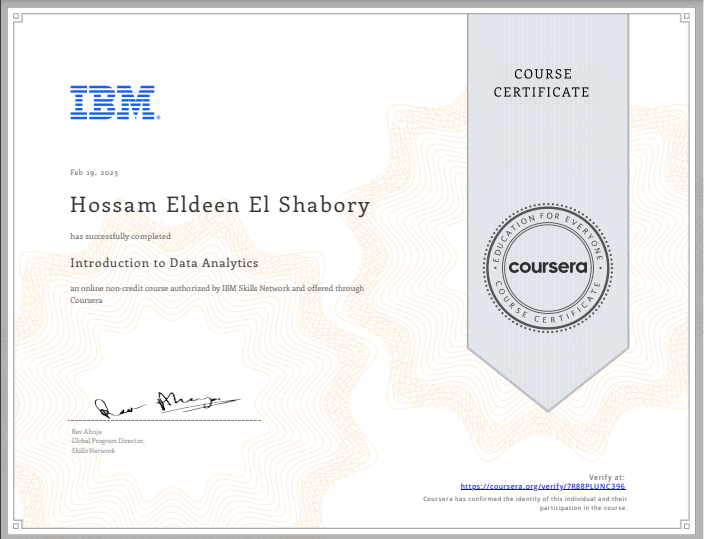

# Introduction to Data Analytics 

## ❔About This Course
This course presents you with a gentle introduction to Data Analysis, the role of a Data Analyst, and the tools used in this job. 

You will learn about the skills and responsibilities of a data analyst and hear from several data experts sharing their tips & advice to start a career. 

This course will help you to differentiate between the roles of Data Analysts, Data Scientists, and Data Engineers. 

## 🔗[Certificate](https://coursera.org/share/02026a80d833f1ee6a2c8b42e07bab95)

