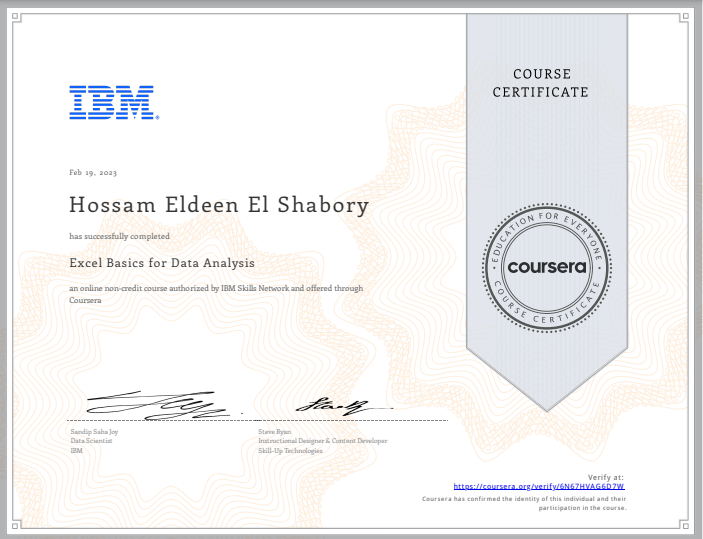

# Excel Basics for Data Analysis 

## ❔About This Course
Spreadsheet tools like Excel are an essential tool for working with data - whether for data analytics, business, marketing, or research. 

This course is designed to give you a basic working knowledge of Excel and how to use it for analyzing data. 

## 🔗[Certificate](https://coursera.org/share/75f31c2d9635d76e76a140ccd87ed0e9)

