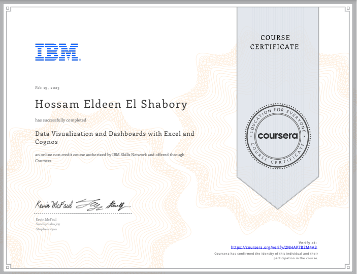

# Data Visualization and Dashboards with Excel and Cognos 

## ❔About This Course
This course covers some of the first steps for telling a compelling story with your data using various types of charts and graphs. 

You'll learn the basics of visualizing data with Excel and IBM Cognos Analytics without having to write any code. 

## 🔗[Certificate](https://www.coursera.org/account/accomplishments/verify/2NHAP7B2M4A3?utm_source=link&utm_medium=certificate&utm_content=cert_image&utm_campaign=pdf_header_button&utm_product=course)

