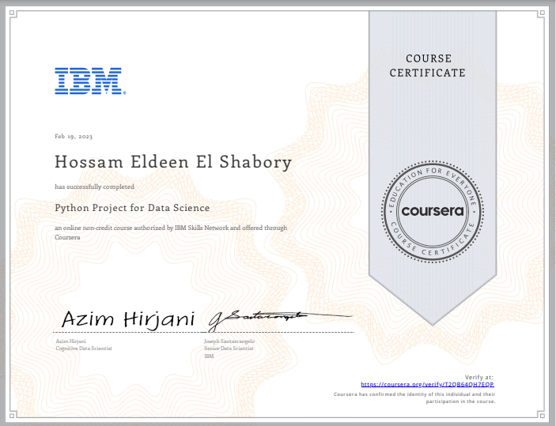

# Python Project for Data Science 

## ❔About This Course

This course primarily involves completing a project in which you will assume the role of a Data Scientist or a Data Analyst and be provided with a real-world data set and a real-world inspired scenario to identify patterns and trends. 

## 🔗[Certificate](https://coursera.org/share/ac5cf41db59b19bc8711903746005386)

