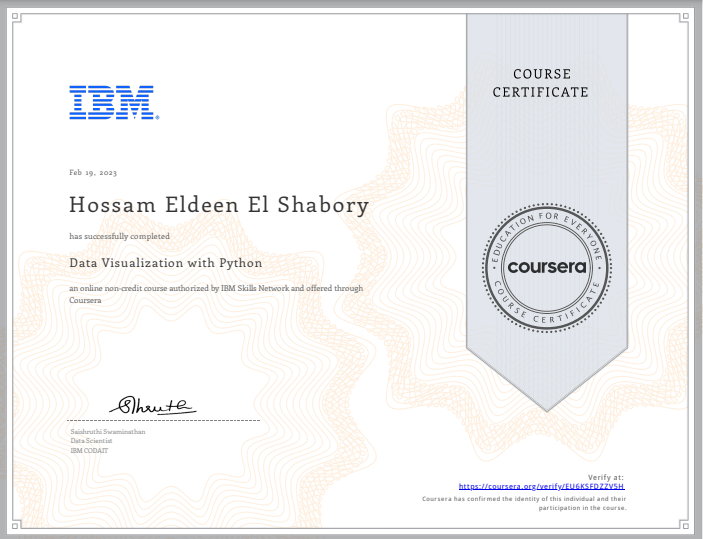

# Data Visualization with Python 

## ❔About This Course

One of the most important skills of successful data scientists and data analysts is the ability to tell a compelling story by visualizing data and findings in an approachable and stimulating way. 

In this course you will learn many ways to effectively visualize both small and large-scale data. You will be able to take data that at first glance has little meaning and present that data in a form that conveys insights. 

## 🔗[Certificate](https://coursera.org/share/d7cff5ecb2fae52a3263314d01989b0a)

