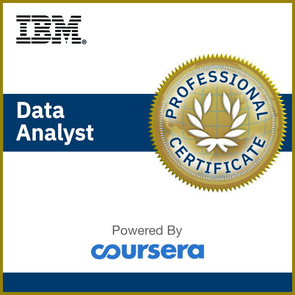

# IBM Data Analyst Capstone Project 

## ❔About This Course

By completing this final capstone project you will apply various Data Analytics skills and techniques that you have learned as part of the previous courses in the IBM Data Analyst Professional Certificate. 

You will assume the role of an Associate Data Analyst who has recently joined the organization and be presented with a business challenge that requires data analysis to be performed on real-world datasets.  

## 🔗[Certificate](https://coursera.org/share/2f8df83dfca5dd9f0f8de47c7d74bb7c)

