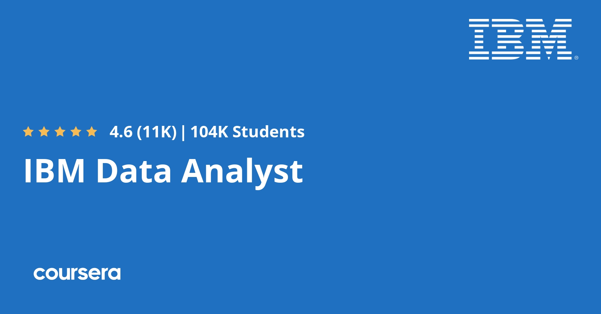
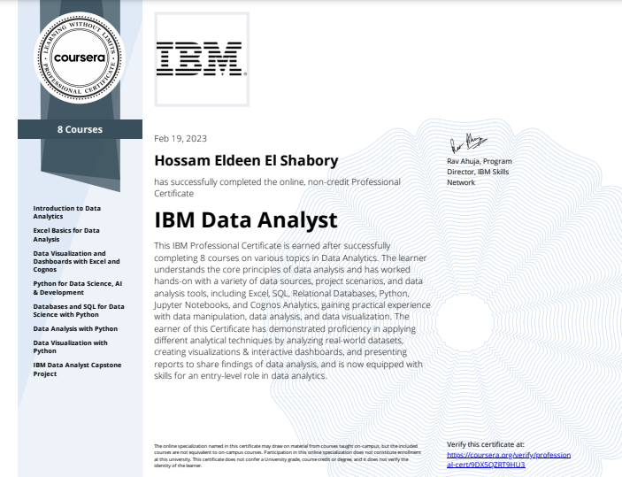
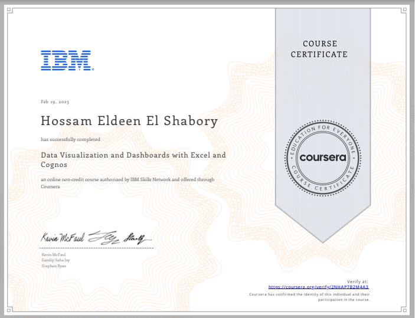
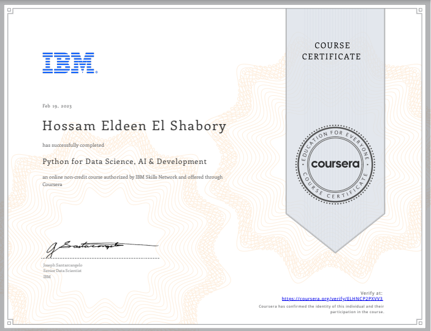
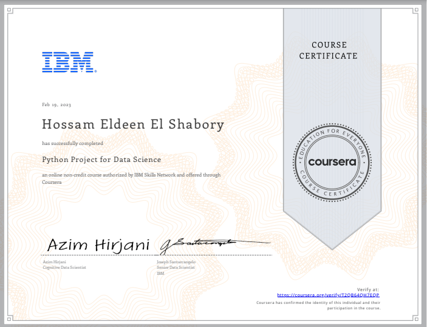
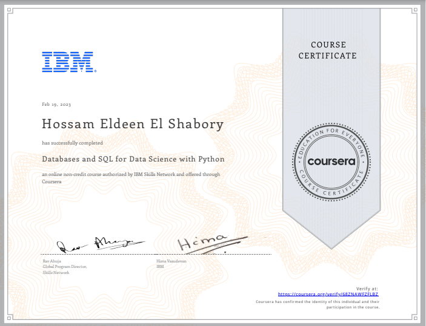
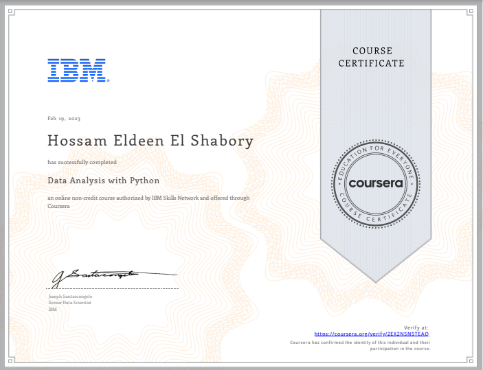
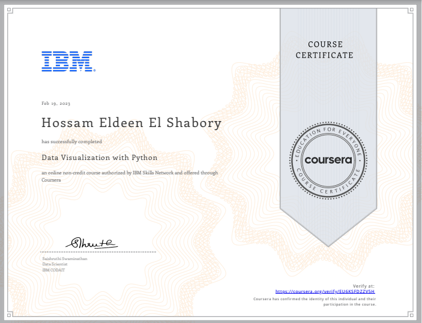
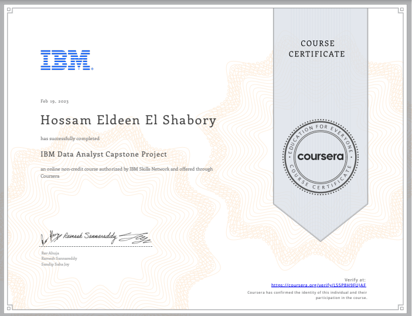

<h1 align="center">
<a href="https://www.coursera.org/professional-certificates/ibm-data-analyst">IBM Data Analyst Professional Certificate</a>
</h1>

<h3 align="center">

</h3>

    

## ❔About this Professional Certificate

Gain the job-ready skills for an entry-level data analyst role through this Professional Certificate from IBM and position yourself competitively in the thriving job market for data analysts, which will see a 20% growth until 2028 (U.S. Bureau of Labor Statistics).

Power your data analyst career by learning the core principles of data analysis and gaining hands-on skills practice. You’ll work with a variety of data sources, project scenarios, and data analysis tools, including Excel, SQL, Python, Jupyter Notebooks, and Cognos Analytics, gaining practical experience with data manipulation and applying analytical techniques.

This Professional Certificate does not require any prior programming or statistical skills, and is suitable for learners with or without college degrees. All you need to get started is basic computer literacy, high school math, comfort working with numbers, willingness to learn, and a desire to enrich your profile with valuable skills.

****

## 🥇🔗[Data Analyst Professional Certificate](https://coursera.org/share/be7ed68f739d97d14f275b14208de581)

    

****
# 📑 Course Content

<em>There are 9 Courses in this Professional Certificate.</em>

### [📓 Introduction to Data Analytics](https://github.com/hossam-elshabory/IBM-Data-Analyst-Professional/tree/main/01_Introduction%20to%20Data%20Analytics)

Click To View The Certificate & The About This Course Section.

### ❔About This Course
This course presents you with a gentle introduction to Data Analysis, the role of a Data Analyst, and the tools used in this job. 

You will learn about the skills and responsibilities of a data analyst and hear from several data experts sharing their tips & advice to start a career. 

This course will help you to differentiate between the roles of Data Analysts, Data Scientists, and Data Engineers. 

### 🔗[Certificate](https://coursera.org/share/02026a80d833f1ee6a2c8b42e07bab95)

    

****

### [📓 Excel Basics for Data Analysis](https://github.com/hossam-elshabory/IBM-Data-Analyst-Professional/tree/main/02_Excel%20Basics%20for%20Data%20Analysis)

Click To View The Certificate & The About This Course Section.

### ❔About This Course
Spreadsheet tools like Excel are an essential tool for working with data - whether for data analytics, business, marketing, or research. 

This course is designed to give you a basic working knowledge of Excel and how to use it for analyzing data.

## 🔗[Certificate](https://coursera.org/share/75f31c2d9635d76e76a140ccd87ed0e9)

    

****

### [📓 Data Visualization and Dashboards with Excel and Cognos](https://github.com/hossam-elshabory/IBM-Data-Analyst-Professional/tree/main/03_Data%20Visualization%20and%20Dashboards%20with%20Excel%20and%20Cognos)

Click To View The Certificate & The About This Course Section.

### ❔About This Course
This course covers some of the first steps for telling a compelling story with your data using various types of charts and graphs. 

You'll learn the basics of visualizing data with Excel and IBM Cognos Analytics without having to write any code. 

### 🔗[Certificate](https://www.coursera.org/account/accomplishments/verify/2NHAP7B2M4A3?utm_source=link&utm_medium=certificate&utm_content=cert_image&utm_campaign=pdf_header_button&utm_product=course)

    

****

### [📓 Python for Data Science, AI & Development](https://github.com/hossam-elshabory/IBM-Data-Analyst-Professional/tree/main/04_Python%20for%20Data%20Science%2C%20AI%20%26%20Development)

Click To View The Certificate & The About This Course Section.

### ❔About This Course
Python is one of the most popular languages in the programming and data science world and demand for individuals who have the ability to apply Python has never been higher.  

### 🔗[Certificate](https://coursera.org/share/3caee43c200fb50056441046185fef5f)

    

****

### [📓 Python Project for Data Science](https://github.com/hossam-elshabory/IBM-Data-Analyst-Professional/tree/main/05_Python%20Project%20for%20Data%20Science)

Click To View The Certificate & The About This Course Section.

### ❔About This Course
This course primarily involves completing a project in which you will assume the role of a Data Scientist or a Data Analyst and be provided with a real-world data set and a real-world inspired scenario to identify patterns and trends. 

### 🔗[Certificate](https://coursera.org/share/ac5cf41db59b19bc8711903746005386)

    

****

### [📓 Databases and SQL for Data Science with Python](https://github.com/hossam-elshabory/IBM-Data-Analyst-Professional/tree/main/05_Python%20Project%20for%20Data%20Science)

Click To View The Certificate & The About This Course Section.

### ❔About This Course
Working knowledge of SQL (or Structured Query Language) is a must for data professionals like Data Scientists, Data Analysts and Data Engineers. Much of the world's data resides in databases.

SQL is a powerful language used for communicating with and extracting data from databases.  

### 🔗[Certificate](https://coursera.org/share/02e9c89f8c8e1ed90e8c3d2a2d08ba29)

    

****

### [📓 Data Analysis with Python](https://github.com/hossam-elshabory/IBM-Data-Analyst-Professional/tree/main/07_Data%20Analysis%20with%20Python)

Click To View The Certificate & The About This Course Section.

### ❔About This Course
Analyzing data with Python is an essential skill for Data Scientists and Data Analysts. This course will take you from the basics of data analysis with Python to building and evaluating data models.  

### 🔗[Certificate](https://coursera.org/share/805c23ab934d106a85f545a4895d4c54)

    

****

### [📓 Data Visualization with Python](https://github.com/hossam-elshabory/IBM-Data-Analyst-Professional/tree/main/08_Data%20Visualization%20with%20Python)

Click To View The Certificate & The About This Course Section.

### ❔About This Course
One of the most important skills of successful data scientists and data analysts is the ability to tell a compelling story by visualizing data and findings in an approachable and stimulating way. 

In this course you will learn many ways to effectively visualize both small and large-scale data. You will be able to take data that at first glance has little meaning and present that data in a form that conveys insights. 

### 🔗[Certificate](https://coursera.org/share/d7cff5ecb2fae52a3263314d01989b0a)

    

****

### [📓 IBM Data Analyst Capstone Project](https://github.com/hossam-elshabory/IBM-Data-Analyst-Professional/tree/main/09_IBM%20Data%20Analyst%20Capstone%20Project)

Click To View The Certificate & The About This Course Section.

### ❔About This Course
By completing this final capstone project you will apply various Data Analytics skills and techniques that you have learned as part of the previous courses in the IBM Data Analyst Professional Certificate. 

You will assume the role of an Associate Data Analyst who has recently joined the organization and be presented with a business challenge that requires data analysis to be performed on real-world datasets.  

### 🔗[Certificate](https://coursera.org/share/2f8df83dfca5dd9f0f8de47c7d74bb7c)

    

****
